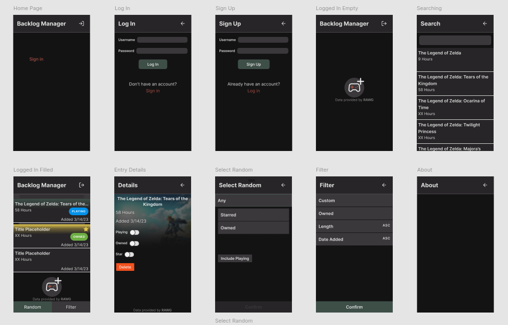
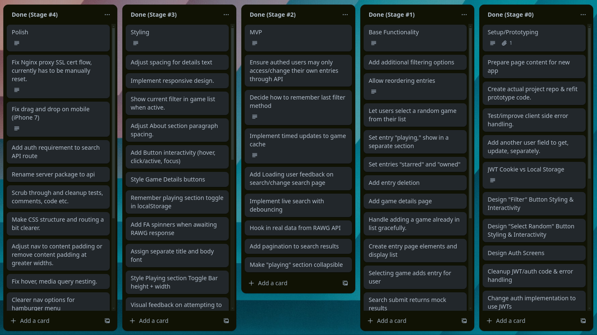

# Games Not Played

Games Not Played is a web app intended to help users decide what game to play next.

Log in to curate, order and sort a list of games you're considering playing next, and keep track of what you're currently playing.

This is my final project for Inventive Academy's [Full Stack Immersive](https://learn.inventiveacademy.io/p/full-stack-immersive-bootcamp-with-node) web development course.

### Documentation: [Check out the wiki!](https://github.com/me-julian/final-project-games-not-played/wiki)

I like writing documentation. Here you can see detailed info on dev setup, the CI CD pipeline and how to setup the AWS cloud infrastructure to host the app.

## Tech Stack

### App

-   [PNPM](https://pnpm.io/) Monorepo
-   [Docker](https://www.docker.com/) and [VS Code Dev Containers](https://code.visualstudio.com/docs/devcontainers/containers)
-   [Typescript](https://www.typescriptlang.org/)
-   [ReactJS](https://react.dev/) & [React Router](https://reactrouter.com/) with [Vite](https://vitejs.dev/)
-   [Express](https://expressjs.com/) REST API
-   MySQL Database with [Sequelize](https://sequelize.org/) ORM using [sequelize-typescript](https://github.com/sequelize/sequelize-typescript)
-   [Passport.js](https://www.passportjs.org/) for username & password authentication with JWTs
-   [Vitest](https://vitest.dev/) with [React Testing Library](https://testing-library.com/docs/react-testing-library/intro) for E2E testing

### Hosting and CI/CD

-   [Github Actions](https://github.com/features/actions)
-   [AWS Elastic Beanstalk](https://aws.amazon.com/elasticbeanstalk/)
-   [GetSSL](https://github.com/srvrco/getssl)

## Development Resources

View the [Figma design](https://www.figma.com/design/YgqdrvqSiBKGI61HwIVXrq/Main-Design-2024?m=auto&t=qQ2FIVCIR4OfliHz-1) to see a rough draft of the app I created before development.

    

I also used a Trello board to track progress and tasks during development.

    

